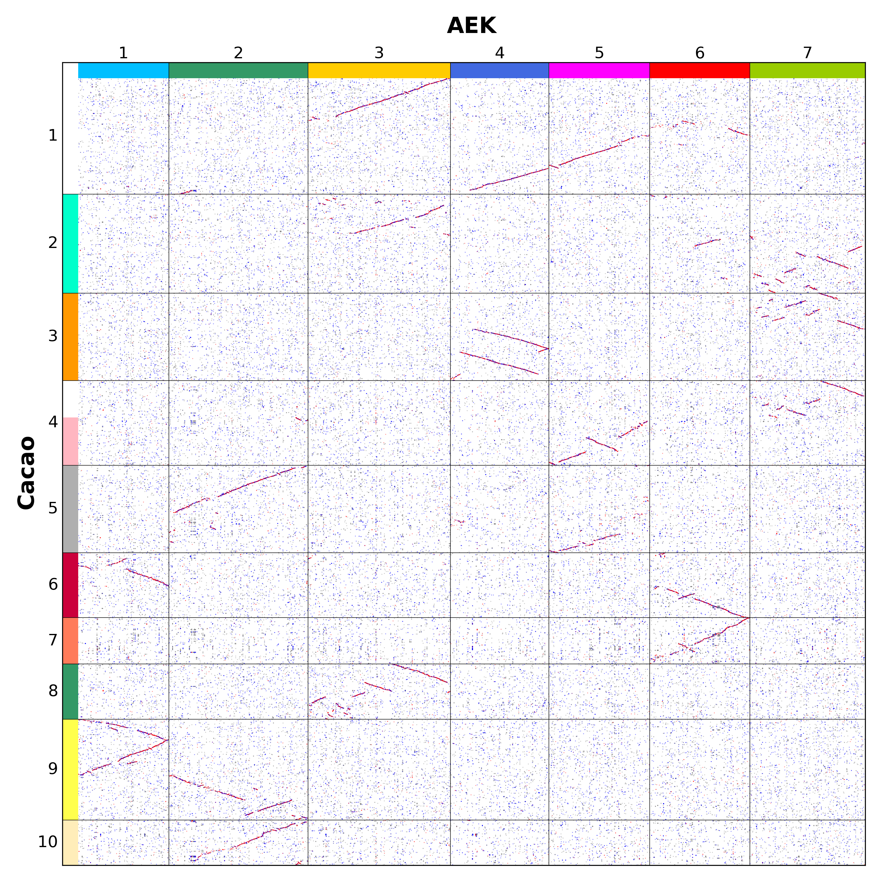
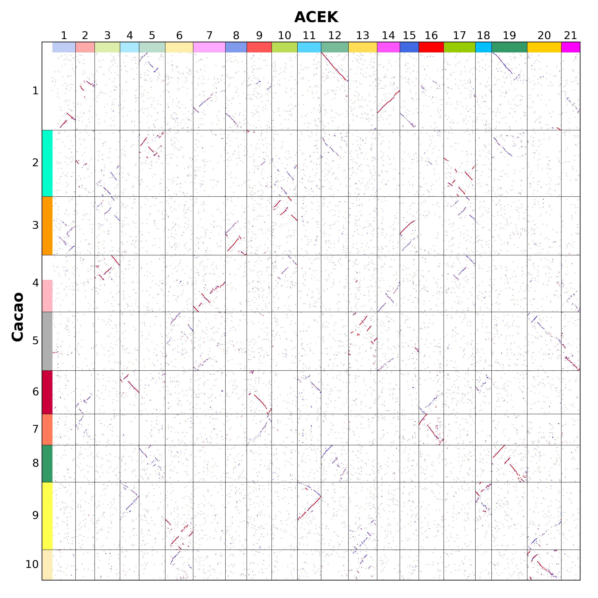
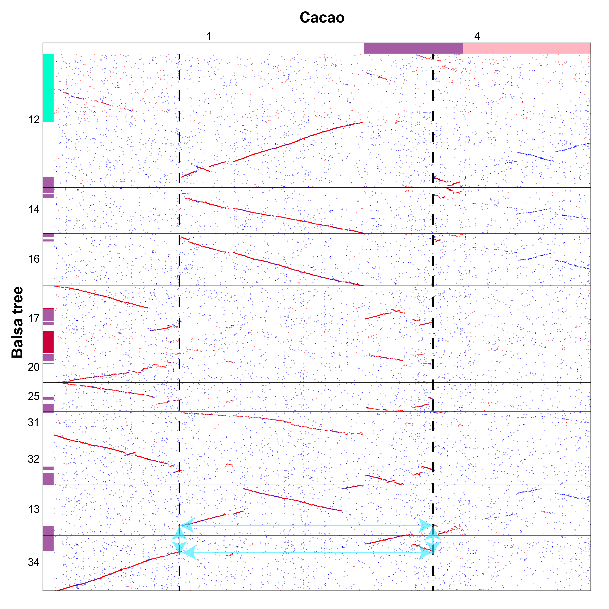
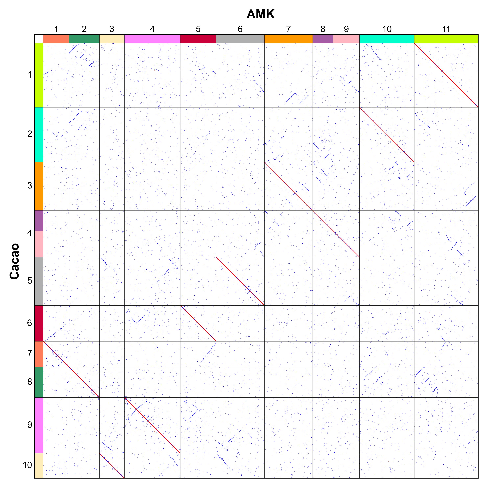

Based on the example of karyotype evolution at https://github.com/SunPengChuan/wgdi-example/blob/main/Karyotype_Evolution.md, here we provide a detailed presentation of the reconstruction process of the Ancestral Karyotype of the Malvaceae (AMK).

In the Malvaceae family, there are two clades: the Byttneriina clade and the Malvadendrina clade. If the colinearity of chromosomes is intact and independently preserved between two species from these two clades, then it’s highly likely that they inherited the protochromosomes of the Malvaceae family. From the homologous dotplot between the Balsa tree (Opy, Malvadendrina) and cacao (Tca, Byttneriina), we can easily identify chromosomes that correspond to EEJ (end-end joining) or NCF(nested chromosome fusion), which we are prepared to refer to as **chromosome-like synteny blocks (CLSBs)**. Such as independent: 
Tca2 = Opy7, 35; 
Tca3 = Opy5, 6, 15, 26 ;
Tca5 = Opy4, 28;
Tca6 = Opy19, 23;
Tca8 = Opy40;
Tca9 = Opy2, 3, 8, 36;
Tca10 = Opy21, 41; 
Tca7 matches with NCF or EEJ in Opy10, 11, 37, and 38;
Opy27, 29, and 42 match with EEJ in Tca4.
Currently, 9 protochromosomes have been identified.

We assigned different colors to these protochromosomes, while the remaining regions will be in white.

The protochromosomes of AMK must have been inherited from even more ancient ancestral karyotypes, such as AEK or ACEK. By comparing dotplots of cacao against AEK and ACEK (Ancestral core eudicots karyotypes), we can determine that cacao Chr4 was inherited from AEK7 or ACEK3. Currently, 10 protochromosomes have been identified.

The remaining cacao Chr1 could either be derived from a single protochromosome, or resulted from the fusion of multiple protochromosomes. From the dot plot comparison between the Balsa tree and cacao, it's evident that Chr1 of cacao is predominantly divided into two distinct sections. We have isolated the chromosome regions associated with the blank areas and subsequently created a new dot plot for better visualization.

Taking Opy13 and Opy34 as examples, the fusion positions of Chr1 and Chr4 in cacao is shared and corresponds to the RTA (Reciprocal Translocation of Chromosome Arms) model. In addition, this phenomenon exists in all five subgenomes of the Balsa tree. Therefore, Chr1 of cacao is a protochromosome. 

In conclusion, all the chromosomes of cacao can be mapped to the 11 protochromosomes without any gaps or missing regions. Therefore, all 11 protochromosomes have been successfully identified.

